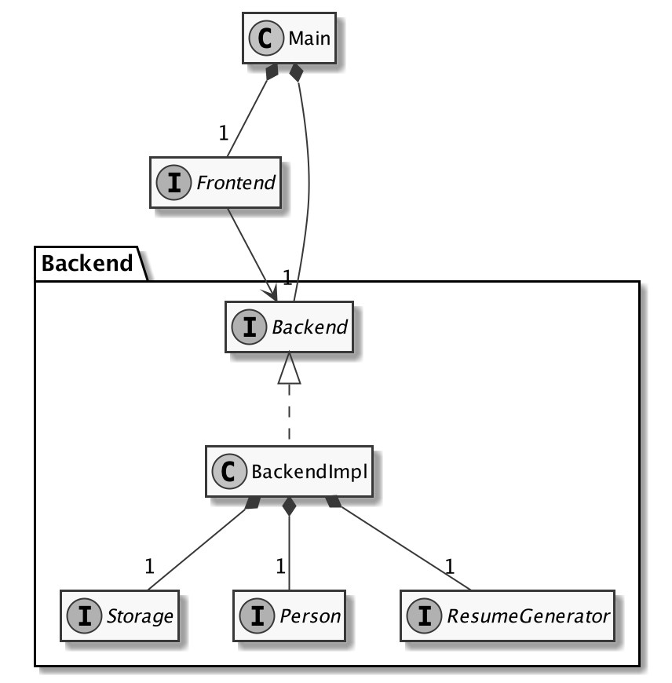

# ResuMe
ResuMe is an application targeted at University students. It allows students to consolidate their personal achievements and projects, select specific achievements and generate aesthetically-pleasing resumes automatically.

## Milestone 1
We are now at the first iteration of our development, where we aim to create the following features:
- Ability to serve a single user
- Ability to add Personal Projects to a user's list of achievements
- Ability to generate plain text resumes to be saved as PDF

Currently, the backend is nearing its completion stages for this iteration.
The overall architecture of the backend and how it links to the frontend is as follows:

The detailed class diagram for the backend logic is as follows:

